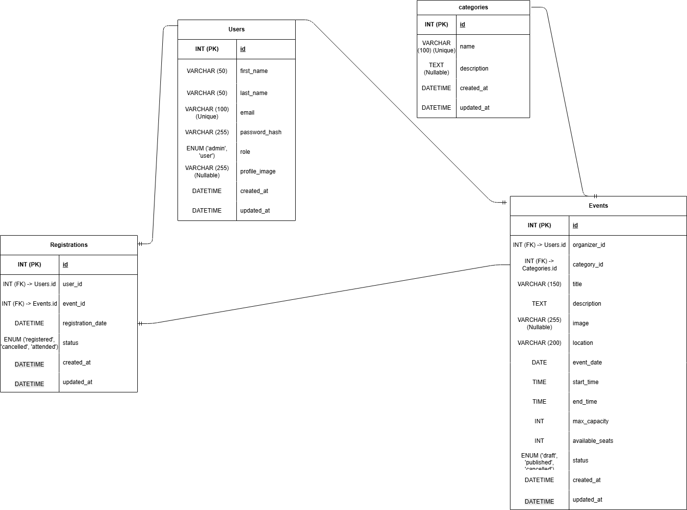

# Event Management System

A full-stack Event Management System developed using:

- React
- FastAPI
- SQLAlchemy
- MySQL
- JWT Authentication

## Documentation

- Software Requirements Specification
- Entity Relationship Diagram

## Features

- User Authentication
- Event Management
- Event Registration
- Admin Dashboard
- Calendar View
- User Profile
- Search & Filters

## Status

🚧 Under Development