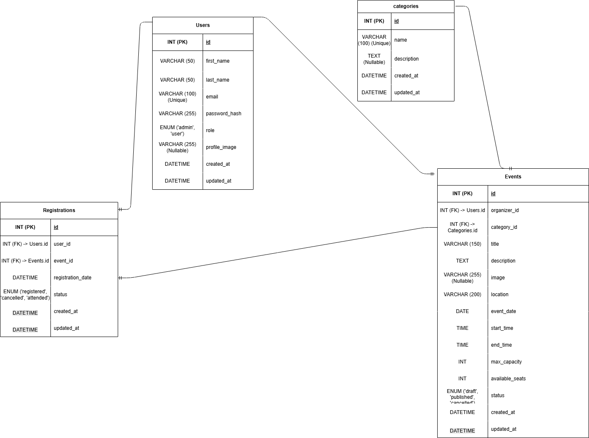

# Event Management System — EventHub

EventHub is a full-stack Event Management System that allows users to discover and register for events, while administrators can manage events, categories, users, and registrations through a dedicated admin dashboard.

The project is built with **React** on the frontend and **FastAPI** with **SQLAlchemy** and **MySQL** on the backend.

## Documentation

- Software Requirements Specification
- Entity Relationship Diagram

## Features

### 👤 User Features

- User registration and login
- JWT-based authentication
- User profile management
- Browse available events
- View event details
- Search events
- Filter events by:
  - Category
  - Location
  - Timeframe
  - Availability
- Hide sold-out events
- Register for events
- Cancel event registrations
- View registered events
- Calendar view for events
- View event locations on an interactive map

### 📅 Event Management

Users can browse detailed event information including:

- Event title
- Description
- Category
- Organizer
- Date
- Start and end time
- Location
- Available seats
- Maximum capacity
- Event image
- Interactive map location

The system also manages event capacity automatically when users register or cancel their registration.

### 🛠️ Admin Dashboard

Administrators have access to a dedicated dashboard for managing the system.

#### Dashboard Statistics

The dashboard currently provides:

- Total events
- Total users
- Total registrations
- Total categories
- Events by category

#### Event Management

Administrators can:

- Create events
- View events
- View event details
- Update events
- Delete events
- Assign organizers
- Assign categories
- Set event capacity
- Set event status
- Select event locations using an interactive map
- Upload event images

#### Category Management

Administrators can:

- Create categories
- View categories
- Update categories
- Delete categories
- Prevent duplicate category names
- Prevent deleting categories that are being used by events

#### User Management

Administrators can:

- View users
- View individual user details
- Update users
- Delete users when they have no associated events or registrations

#### Registration Management

Administrators can:

- View registrations
- View registration details
- Update registration status
- Manage registration states such as:
  - Registered
  - Cancelled
  - Attended

## 🔐 Authentication

EventHub uses **JWT authentication** to protect authenticated routes.

Authentication includes:

- User registration
- User login
- Current user information
- Protected user routes
- Protected administrator routes
- Role-based authorization

The system supports two roles:

- `user`
- `admin`

Administrator access is restricted to users with the `admin` role.

## 🗺️ Interactive Event Locations

The admin event form includes an interactive map using **Leaflet**.

Administrators can select an event location directly on the map.

The system stores:

- Latitude
- Longitude
- Location name

Reverse geocoding is used to determine the location name from the selected coordinates.

## 🖼️ Event Images

Administrators can upload event images when creating events.

Supported image formats:

- JPG
- PNG
- WEBP

Uploaded event images are stored separately from the source code and are served by the FastAPI backend.

## 🔎 Search and Filtering

The public event listing supports multiple filters.

### Search

Users can search events by:

- Title
- Description
- Location

### Category

Users can filter events by one or multiple categories.

Categories are loaded dynamically from the database rather than being hardcoded in the frontend.

### Location

Users can filter events by location.

### Timeframe

Available timeframe filters include:

- This month
- Next month
- This year

### Availability

Users can choose to hide sold-out events.

## 📆 Calendar View

EventHub provides two event viewing modes:

- Grid view
- Calendar view

The calendar displays events according to their event dates, making it easier for users to discover upcoming events.

## 📝 Event Registration

Users can register for events while seats are available.

The registration system automatically manages event capacity.

## 🏗️ Project Architecture
The backend follows a layered architecture:

    API
    ↓
    Service
    ↓
    CRUD
    ↓
    Models
    ↓
    MySQL Database

## Backend Responsibilities

Models

Define database tables and relationships using SQLAlchemy.

Schemas

Handle request and response validation using Pydantic.

CRUD

Handle database operations.

Services

Contain business logic and validation.

API

Defines HTTP endpoints and dependencies.

## 🛠️ Technology Stack

Frontend:
    - React
    - React Router
    - Bootstrap
    - Bootstrap Icons
    - Axios
    - Leaflet
    - React Leaflet

Backend:
    - Python
    - FastAPI
    - SQLAlchemy
    - Pydantic
    - JWT Authentication
    - OAuth2 Password Flow

Database: 
    - MySQL / MariaDB
    - XAMPP
    - phpMyAdmin

Development Tools: 
    - Git
    - GitHub
    - Visual Studio Code
